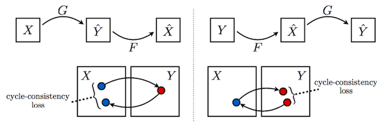
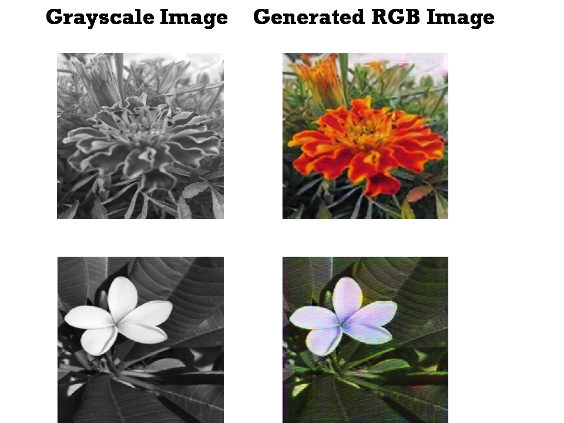
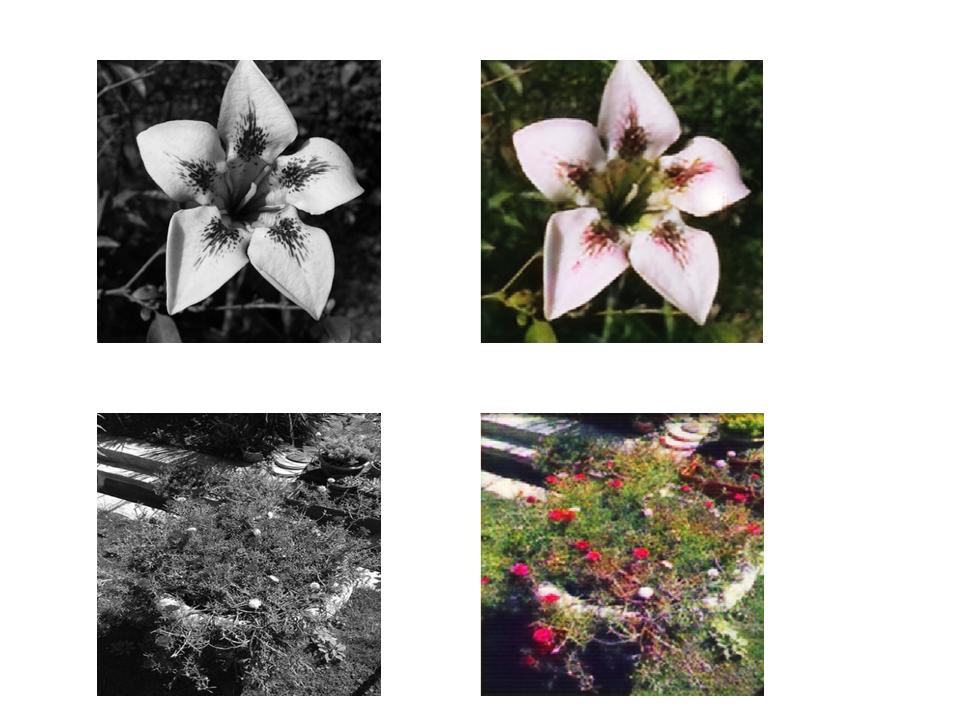
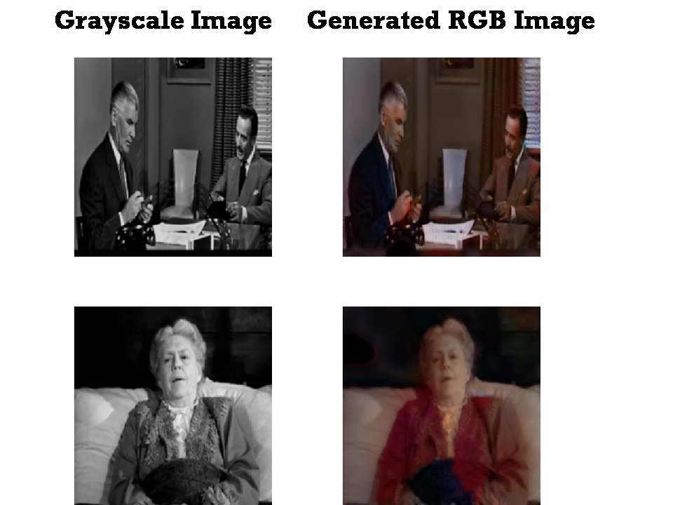
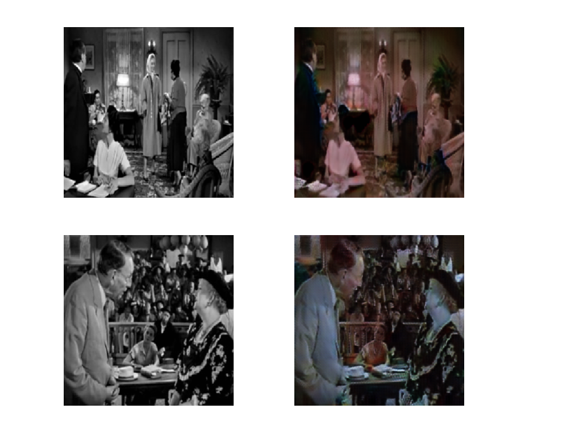

# Image-colorization-using-CycleGAN

# Introduction

Automatic image colorization has been a popular image-to-image translation problem of significant interest for several practical application areas including restoration of aged or degraded images. This project attempts to utilize CycleGANs to colorize grayscale images back to their colorful RGB form.

# Overview

Image-to-image  translation  is  a  class  of  vision  and graphics problems where the goal is to learn the mapping
between an input image and an output image using a training set of aligned image pairs. But for many tasks, paired training data may not be available like this problem of image colorization. This is where the power of CycleGAN becomes apparent. Superiority of CycleGAN has been demonstrated on several tasks where paired training data hardly exist, e.g., in object transfiguration and painting style and season transfer

# Model

Generative Adversarial Networks(GANs) are composed of two models:
1. Generator: Aims to generate new data similar to the expected one. The Generator could be related to a human art forger, which creates fake works of art.
2. Discriminator: It's goal is to recognize if an input data is ‘real’ — belongs to the original dataset — or if it is ‘fake’ — generated by a forger. In this scenario, a Discriminator is analogous to  an art expert, who tries to detect artworks as truthful or fraud.

The CycleGAN consists of 2 generators and discriminators. One generator maps from domain A to B and the other one, from B to A.
They compete with their corresponding adversarial discriminators.

To regularize the model, the authors introduce the constraint of cycle-consistency - if we transform from source distribution to target and then back again to source distribution, we should get samples from our source distribution.

# Data

The experiment was done on 2 datasets: 
1. Grayscale of flowers(domain A) and their RGB version(domain B): 2K images in each folder.
2. Frames extracted from old B&W movies(domain A) and new movies (domain B): 24K images in each folder.

The second problem is a very interesting one as the frames are taken from very old movies(1950s and before) and there is no scope for paired data, making this a useful application for CycleGAN.

# Training

The models were trained on a GPU. It took about 15 hours for the first model to train. The 2nd model took a bit longer to achieve decent results, after training about 20 hours. Sample results were frequently monitored through TensorBoard.

# Results

The first model yielded fine results. Some of the best ones are shown below:

For the second model the results were also good, some of which are shown below:

# References
- Original Paper: [Arxiv](https://arxiv.org/abs/1703.10593)
- Base project [Github](https://github.com/xhujoy/CycleGAN-tensorflow)
- Dataset: https://drive.google.com/file/d/1-3DKl_h5NkJWyXib-AVf4ioPY236lsgM/view?usp=sharing
